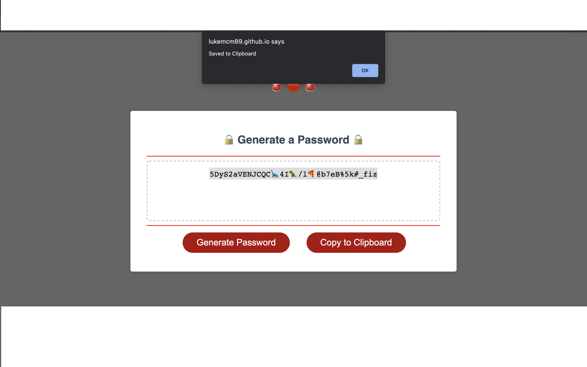

# Password-Generator
Update:

Grade on Assignment: A+

A working Password Generator.

The user must select a password between 8-128 characters, and select whether they want uppercase and lowercase letters, special symbols and numbers. (For fun, I added emojis)

Upon various user selections, the password is randomly generated.

I made stylistic changes to the CSS in an effort to make the interface and overall webpage less abrasive and more appealing to the user, rather than a stale, bright-white screen. I also added an extra Copy-to-Clipboard function. 

Thank you for your time! 

Deployed website: https://lukemcm89.github.io/Password-Generator/

Github Repository: https://github.com/LukeMcM89?tab=repositories

