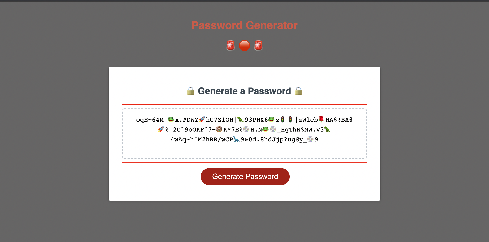

# Password-Generator

A working Password Generator.

The user must select a password between 8-128 characters, and select whether they want uppercase and lowercase letters, special symbols and numbers. (For fun, I added emojis)

Upon various user selections, the password is randomly generated.

Going forward I would like to move more away from 'var' and get into the habit of utilizing 'let' per industry standards.

Thank you for your time. 

Deployed website: https://lukemcm89.github.io/Password-Generator/

Github Repository: https://github.com/LukeMcM89?tab=repositories

